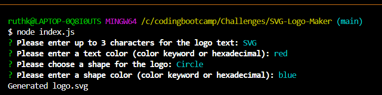
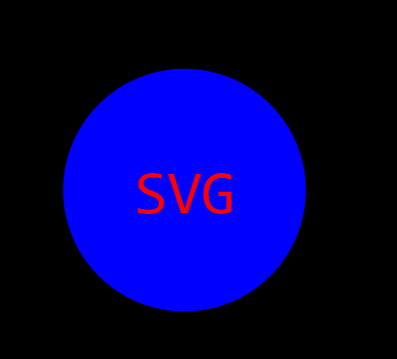
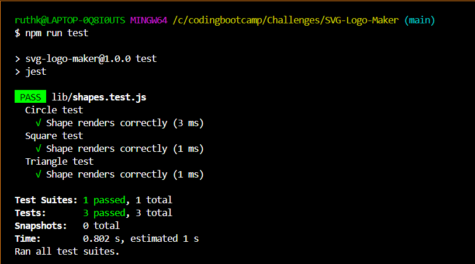

# SVG Logo Maker


## Description
Creating a well-designed logo for a project often requires the need for graphic design skills, software, or an individual who specializes in graphic design, which can be expensive, inefficient, and time consuming. To address this issue, this week’s UT Austin Coding Bootcamp challenge involved building a Node.js command-line application from scratch to allow freelance web developers to create simple logos for clients and personal projects so they may forego paying a graphic designer.

The SVG Logo Maker is a Node.js command-line application which generates simple logos in an SVG format.   Scalable Vector Graphics (SVG) is a versatile and scalable image format that allows for high-quality graphics, making it ideal for logos that need to be displayed across various platforms and sizes. The SVG Logo Maker is a tool that simplifies the process of creating logos by dynamically generating a logo in an SVG format based on a user’s input, utilizing the Inquirer package for an interactive and user-friendly experience that is simple and straightforward making it accessibly for developers of all skill levels. Through interactions with the user via prompts provided by the Inquirer package, the user inputs their preferences as to what their logo will look like, including the shape of their logo (circle, triangle, or square), color of the shape, the text they would like displayed on their logo, and the color of the text. Once the user answers all of the prompts, an SVG file is written and saved using their selections to generate a logo. This application also incorporates unit testing through the use of the Jest package, which ensures the code’s correctness. The single test suite consists of three tests, verifying that the application produces accurate shapes and colors.

The motivation for creating this application was to allow users to quickly and easily generate logos through the use of SVG files through the command line. The SVG Logo Maker also allows users to customize their logos by choosing shapes, colors, and text, enabling them to create unique designs that reflect their brand or project identity.

Overall, the SVG Logo Maker application addresses the need for a simple, cost-effective, and customizable solution for SVG logo creation, empowering users to create logos for their projects with ease while providing participants with an opportunity to demonstrate their technical skills and creativity in full-stack application development.


## Table of Contents
- [SVG Logo Maker](#svg-logo-maker)
  - [Description](#description)
  - [Table of Contents](#table-of-contents)
  - [User Story](#user-story)
  - [Acceptance Criteria](#acceptance-criteria)
  - [Installation](#installation)
  - [Usage](#usage)
    - [Screenshots:](#screenshots)
    - [Walkthrough Video Link:](#walkthrough-video-link)
  - [Credits](#credits)
  - [Test Instructions](#test-instructions)
  - [License](#license)
  - [Questions](#questions)


## User Story

```md
AS a freelance web developer
I WANT to generate a simple logo for my projects
SO THAT I don't have to pay a graphic designer
```

## Acceptance Criteria

```md
GIVEN a command-line application that accepts user input
WHEN I am prompted for text
THEN I can enter up to three characters
WHEN I am prompted for the text color
THEN I can enter a color keyword (OR a hexadecimal number)
WHEN I am prompted for a shape
THEN I am presented with a list of shapes to choose from: circle, triangle, and square
WHEN I am prompted for the shape's color
THEN I can enter a color keyword (OR a hexadecimal number)
WHEN I have entered input for all the prompts
THEN an SVG file is created named `logo.svg`
AND the output text "Generated logo.svg" is printed in the command line
WHEN I open the `logo.svg` file in a browser
THEN I am shown a 300x200 pixel image that matches the criteria I entered
```

## Installation
To install the SVG Logo Maker, follow the following steps:
1.	Clone the repository to your local machine: `git clone https://github.com/vaughanknouse/SVG-Logo-Maker.git`.
2.	Ensure that the current version of Node.js is installed. 
3.	Open the cloned repository in a CLI, such as Visual Studio (VS) Code.
4.	Navigate to the project directory in your terminal. 
5.	Initialize a project with `package.json` by typing `npm init -y` in the terminal where  project files will be stored.
6.	Install `inquirer` version 8.2.4 by typing `npm i inquirer@8.2.4` in the terminal for information gathering.
7. Install the latest version of Jest by typing `npm i jest` for testing.
8.	Install other necessary dependencies by typing `npm i` in the command line to ensure that the `node-modules` folder is operating on your local device. 


## Usage
To use the SVG Logo Maker, follow the following steps:
1.	Once the dependencies are installed, initialize the application with node.js by running the `index.js` file using the following command in the terminal: `node index.js`.
2.	The application will take you through a series of questions to customize your logo and prompt you to enter information about your logo, such as the text for the logo (up to 3 characters), a color keyword or hexadecimal number for the text color, a shape from the list (circle, square, triangle), and a color keyword or hexadecimal number for the shape color.
3.	Follow the `npm inquirer` prompt questions through sequential order within the directory.
4.	After all of the prompt questions have been answered properly, the application will generate your new logo in a `logo.svg` file based on your input and a message will display on the command line indicating that your logo has been generated.
5.	Once the new `logo.svg` file is generated, find your newly generated SVG file and review the file to see your generated logo.
6. At your discretion, you mae rename the `logo.svg` file to the file name of your choice.
7. Regarding future use, you may alter the prompted questions within the `index.js` file to best suit your needs. 
8. For unit testing instructions, navigate to the "Test Instructions" section of the README. 


### Screenshots:
The following screenshots demonstrate the application's functionality and appearance:





### Walkthrough Video Link: 
To further demonstrate the functionality and typical user flow of the Node.js SVG Logo Maker application, please view the following walkthrough video on Google Drive: [Walkthrough Video Link](https://drive.google.com/file/d/1wCLX0H3KfknXotUFoKQl-URCkGinjDix/view?usp=sharing)


## Credits
Used the following sources as tutorials and guidelines:

Inquirer npm Webpage: https://www.npmjs.com/package/inquirer 

Jest Webpage: https://jestjs.io/docs/getting-started 

SVG Tutorial Webpage: https://developer.mozilla.org/en-US/docs/Web/SVG/Tutorial 

Basic SVG Shapes Webpage: https://developer.mozilla.org/en-US/docs/Web/SVG/Tutorial/Basic_Shapes 

Text in SVG Webpage: https://developer.mozilla.org/en-US/docs/Web/SVG/Tutorial/Texts 

Professional README Guide Webpage: https://coding-boot-camp.github.io/full-stack/github/professional-readme-guide

Video Submission Guide Webpage: https://coding-boot-camp.github.io/full-stack/computer-literacy/video-submission-guide

Also utilized the XPert Learning assistant for some portions of my code:
https://bootcampspot.instructure.com/courses/5293/external_tools/313

## Test Instructions
To perform unit testing using Jest, access the terminal and execute the command `npm run test`. This command runs the test file with the corresponding SVG file with given choices to ensure that the application adheres to the specified requirements and standards. As of now, there is 1 test suite with 3 tests. The test suite verifies that the `render()` method generates the correct string for specified shape color in the associated SVG file. 



## License
This project is licensed under the MIT license. For more information, please visit [this link](https://opensource.org/licenses/MIT).

## Questions
For any questions or feedback, please contact me via email at vaughanknouse@gmail.com.
Additionally, you can find me on GitHub at [vaughanknouse](https://github.com/vaughanknouse).
